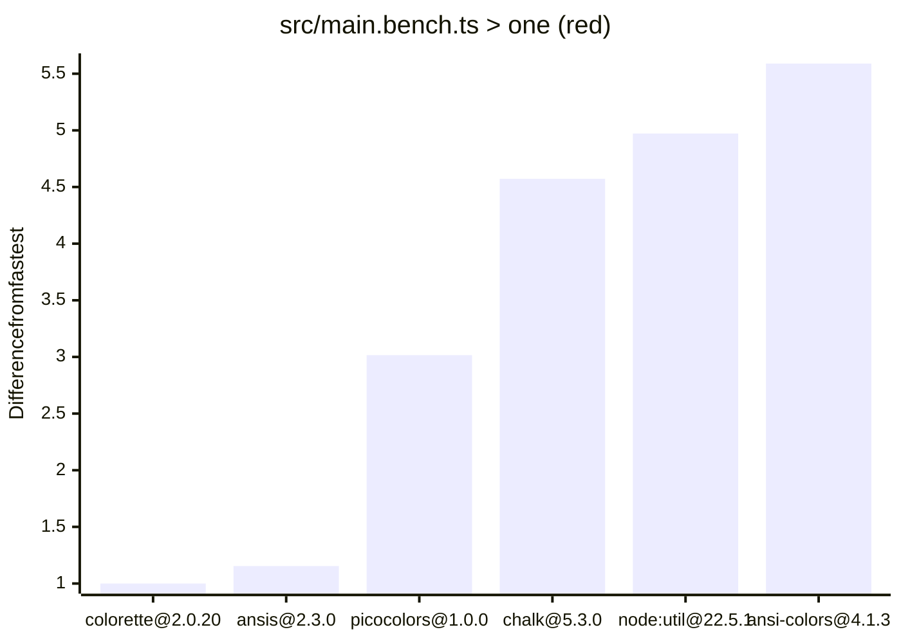
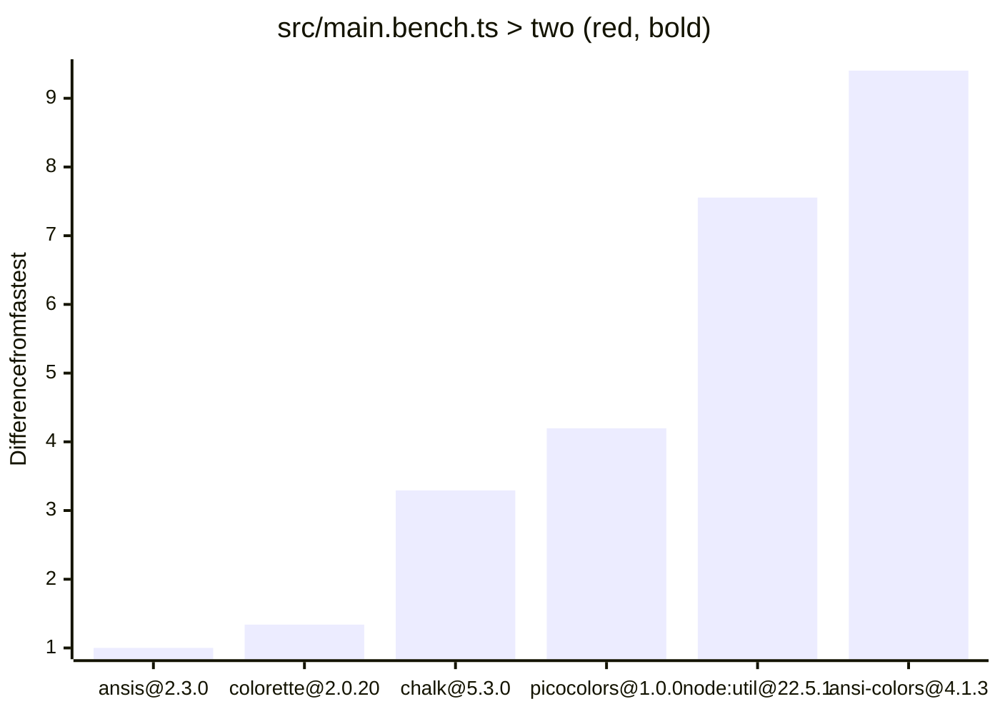
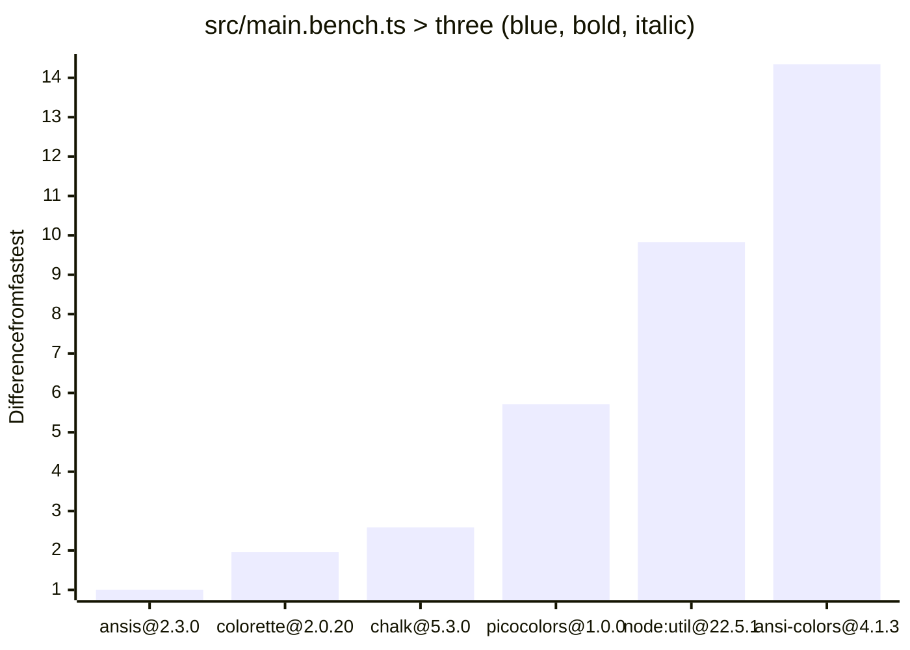
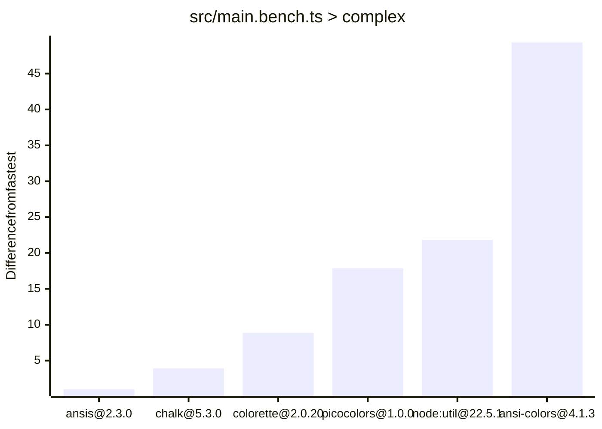

# color-perf

## Run it

1. Install node 21.7+
1. pnpm install
1. pnpm run bench

## Results

Ran on a basic GH Actions runner.

Lower is better. Leftmost is the base, with the others being the difference from the base.

<!-- charts -->

